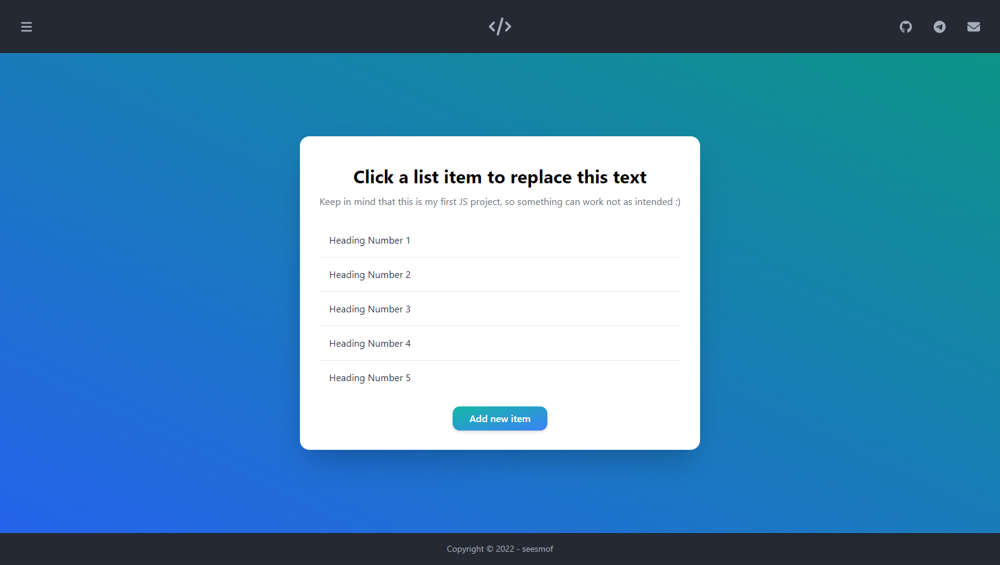

<h3 align="center">JS List App</h3>

---

 JavaScript List Application
     

## 📝 Table of Contents

- [About](#about)
- [Built Using](#built_using)
- [Authors](#authors)
- [Acknowledgments](#acknowledgement)

## 🧐 About 

Very simple one-page application made with JavaScript and some TailwindCSS for initial design. The project was initially developed to learn the very basics of JavaScript and was made from a tutorial by [LearnWebCode](https://www.youtube.com/user/LearnWebCode). He has a really nice YouTube channel with lots of useful videos so I'd recommend you check him out. The project is still in progress, but I can tell that I already like it. Hopefully everything will go smooth and I will catch on some core concepts of JavaScript.

## 🚀 Deployment 

- [Live View](https://seesmof.github.io/js-first-steps/)

## ⛏️ Built Using 

- [HTML](https://www.w3.org/html/) - Markup Language
- [CSS](https://www.w3schools.com/css/) - Styling Language
- [SASS](https://sass-lang.com/) - CSS Pre-Processor
- [TailwindCSS](https://tailwindcss.com/) - CSS Framework
- [JavaScript](https://developer.mozilla.org/en-US/docs/Web/JavaScript) - Programming Language

## ✍️ Authors 

- [@seesmof](https://github.com/seesmof) - Development
- [@LearnWebCode](https://youtu.be/zPHerhks2Vg) - Idea & Desing

## 🎉 Acknowledgements 

- [@LearnWebCode](https://www.youtube.com/user/LearnWebCode) for great videos
